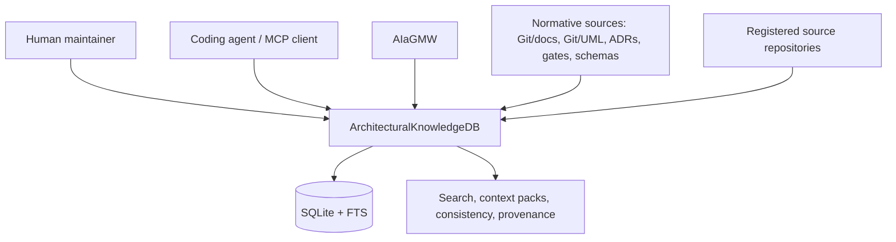
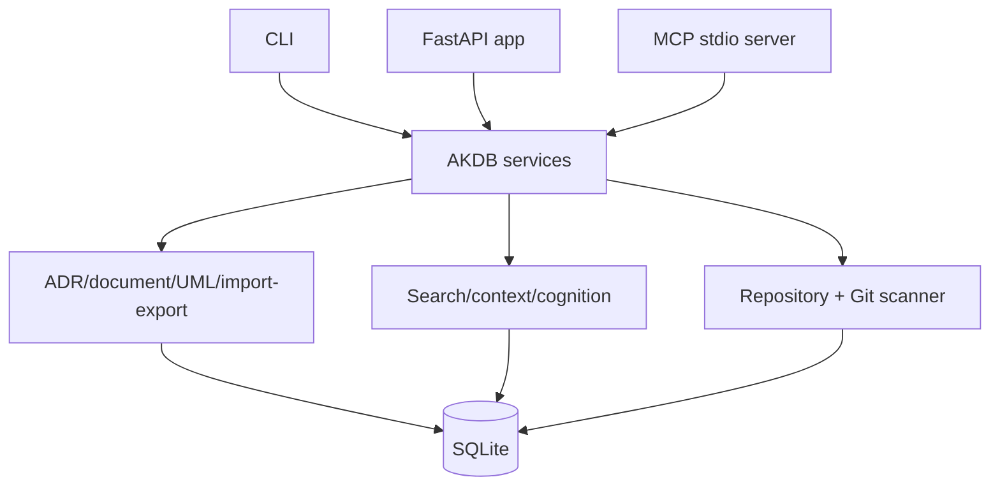

# ArchitecturalKnowledgeDB - Software Architecture (arc42)

**Tool:** `ArchitecturalKnowledgeDB` - **Repository:** `ArchitecturalKnowledgeDB` - **Kind:** outer tool (non-Unreal)
**Last reconciled to code:** `2026-07-01`

## 1. Introduction & Goals

ArchitecturalKnowledgeDB (AKDB) is a standalone Python architecture knowledge database for ADRs,
architecture documents, UML, rules, definitions, source-area notes, selected Git provenance, and
agent context packs. It exposes the same project-aware knowledge through CLI, FastAPI, and MCP stdio
tools so humans, coding agents, AIaGMW, and maintainer workflows can ask for authority-aware context
without making every source repository a database.

AKDB is now described as an active **Outer Tool** in the Tiny Tool Development architecture model. It
is not an Unreal plugin, not a Fab package, not an AI runtime, and not the normative storage location
for Tiny Tools SAD/UML. The normative sources remain `Git/docs`, `Git/UML`, ADRs, gates, fact sheets,
schemas, and owning repositories; AKDB indexes and relates them.

The practical value is a repeatable architecture-working loop: register the project, import the
architecture corpus, register source repositories, scan provenance read-only, ask for context packs or
recall neighborhoods before work, run consistency/staleness checks during review, and reingest after
source changes. The website now presents AKDB as a featured Outer Tool, but that public presentation
is a projection of this SAD and `product-facts.yml`; it does not turn the website or database into a
new source authority.

### 1.1 Quality Goals

| Goal | Scenario |
| --- | --- |
| Authority-aware retrieval | An agent asks for a task context pack and receives guardrails, ADRs, UML, source areas, and Git evidence with source authority kept visible. |
| Read-only repository safety | AKDB scans registered source folders and Git metadata without mutating repositories, source files, UML files, or Git state. |
| Multi-project isolation | Queries default to one project plus explicitly imported shared spaces, so one project cannot silently override another. |
| Agent token economy | MCP bulk/list/search tools return compact records by default and allow `detail=full` when the caller needs complete source material. |
| Public-surface fidelity | Website catalog, Atlas, and AKDB detail pages reflect the Outer Tool boundary and current implemented workflows without claiming Fab or Unreal-plugin status. |

### 1.2 Stakeholders

| Stakeholder | Concern |
| --- | --- |
| Architecture maintainer | Needs searchable current SAD/UML/ADR context without losing file authority. |
| Coding agent / MCP client | Needs cheap recall, context packs, consistency checks, and explainable origin trails. |
| Tool maintainer | Needs CLI/API/MCP surfaces, migrations, tests, and data-root configuration to stay predictable. |
| Website reader / ecosystem evaluator | Needs to understand why AKDB exists, how it is used, which integrations it enables, and where its authority boundary ends. |

### 1.3 Architecture State And Proof-State Ledger

**State described:** Current implementation in the standalone `ArchitecturalKnowledgeDB` repository, plus the
agent-authoring extension described in the project SAD.

| Mechanism | Proof State | Evidence |
| --- | --- | --- |
| Python package, CLI, FastAPI API, MCP stdio server | Implemented | `pyproject.toml`, `architectural_knowledge_db/cli.py`, `api/app.py`, `mcp.py`, `mcp_stdio.py` |
| SQLite migrations, FTS, knowledge services, import/export | Implemented | `architectural_knowledge_db/db/schema/*.sql`, `services/*.py`, pytest suite |
| Multi-project registry, repository registration, read-only Git scan | Implemented | `services/projects.py`, `services/repositories.py`, `services/git_scanner.py`, `tests/test_git_scanner.py` |
| Agent-authoring/cognition layer | Implemented/extended | [AKDB Agent-Authoring Data Model SAD](../../project/akdb-agent-authoring/architecture.md) and [UML](../../../../UML/Project/akdb-agent-authoring/TRACEABILITY.md) |
| Compact MCP retrieval and expanded agent toolset | Implemented | `mcp.py`, `mcp_stdio.py`, `tests/test_mcp_compact.py`, public [MCP note](../../../../../ArchitecturalKnowledgeDB/docs/operations/MCP.md) |
| Reingest, semantic recall hooks, memory/review/guardrail services | Implemented | `services/reingest.py`, `services/recall_backend.py`, `services/memory.py`, `services/review.py`, `services/guardrail.py`, pytest suite |
| Outer Tool publication boundary | Accepted in this SAD | This document, [Outer Tool integration index](../../outer_tools/open/integrate.md), [AKDB README](../../../../../ArchitecturalKnowledgeDB/README.md) |
| Website and Atlas product projection | Implemented/curated | `product-facts.yml`, `Website/content_parts/product_catalog.py`, `Website/content_parts/plugin_catalog_snapshot.json`, `Website/content_parts/tool_pages`, `Website/content_parts/deep_dives`, `Website/content_parts/tests/test_facts_loader.py` |

## 2. Constraints

- AKDB is a standalone Python tool in its own `ArchitecturalKnowledgeDB` repository; it has no Unreal module,
  `.uplugin`, Fab listing, or buyer-package filter.
- Runtime data such as `.akdb/`, SQLite files, `Temp/`, generated exports, and copied corpora must
  not be committed as source architecture material.
- Cross-project SAD/UML authority remains in `D:\TinyToolDevelopment\Git\docs` and
  `D:\TinyToolDevelopment\Git\UML`; AKDB may index those folders but does not replace them.
- Repository and Git scanning is read-only by default. Any future write mode requires an explicit
  architecture decision before implementation.
- Optional semantic recall through embeddings is environment-gated; FTS remains the zero-dependency
  baseline.
- Public website text may celebrate AKDB and explain its workflow, but must preserve the Outer Tool
  classification, local-first deployment, source-authority split, and "not Fab / not Unreal plugin"
  boundary.

## 3. Context & Scope



Authoritative: [C4 context](../../../../UML/Plugins/ArchitecturalKnowledgeDB/components/c4-context.puml),
[Traceability](../../../../UML/Plugins/ArchitecturalKnowledgeDB/TRACEABILITY.puml).

### 3.1 In / Out Of Scope

| In scope | Out of scope |
| --- | --- |
| Project registry, knowledge items, ADR/rule/definition/UML import, search, context packs, consistency/staleness, Git provenance, CLI/API/MCP surfaces. | Unreal Editor UI, Fab package behavior, marketplace buyer workflows, direct source-code mutation, autonomous AI execution. |
| Indexing the Tiny Tool architecture corpus and serving it to agents and tools. | Becoming the source of truth for SAD/UML; generated or imported copies do not outrank owning files. |
| Optional vector/hybrid recall when configured. | Requiring embeddings, cloud services, or a specific AI provider. |
| Product-facts and website/deep-dive projection for the public Outer Tools catalog. | Copying internal SAD prose wholesale into public docs or implying the website is runtime AKDB. |

## 4. Solution Strategy

- Keep files authoritative and make the database an indexed working state with source anchors.
- Use SQLite/FTS as the local, portable default and add migrations additively.
- Expose one consistent service model through CLI, FastAPI, and MCP stdio.
- Preserve project isolation and explicit shared spaces for cross-project knowledge.
- Treat Git provenance as evidence, not normative authority.
- Make the daily workflow concrete: bootstrap, import/reingest, search/recall, context-pack, drift
  review, and reingest again after source changes.
- Use product facts for factual website projection and hand-authored website copy for explanation,
  examples, value framing, and integration narratives.

## 5. Building Block View



Authoritative: [C4 container](../../../../UML/Plugins/ArchitecturalKnowledgeDB/components/c4-container.puml),
[C4 component](../../../../UML/Plugins/ArchitecturalKnowledgeDB/components/c4-component.puml).

| Building block | Responsibility | Evidence |
| --- | --- | --- |
| CLI | Setup, import, search, context-pack, Git scan, consistency, serve, MCP manifest. | `architectural_knowledge_db/cli.py` |
| FastAPI API/admin UI | HTTP service and local admin surface on the configured host/port. | `architectural_knowledge_db/api/app.py` |
| MCP stdio | Tool manifest and JSON-RPC stdio dispatch for MCP clients. | `architectural_knowledge_db/mcp.py`, `mcp_stdio.py` |
| Services | Project, knowledge, context, consistency, staleness, cognition, import/export, Git scanner. | `architectural_knowledge_db/services/*.py` |
| SQLite schema | Project-aware durable state, FTS, links, provenance, cognition/authoring additions. | `architectural_knowledge_db/db/schema/*.sql` |
| Website projection | Product card, detail page, deep dive, Atlas node, and deploy snapshot for AKDB as Outer Tool. | `product-facts.yml`, `Website/content_parts/product_catalog.py`, `Website/content_parts/tool_pages/architectural_knowledge_db.py`, `Website/content_parts/deep_dives/architectural_knowledge_db.py` |

Structured document import accepts single- and multi-document YAML. A single document retains its
native payload shape; multiple non-empty documents are preserved in source order under
`document_count` and `documents`, so one valid YAML stream cannot abort a complete project reingest.

## 6. Runtime View

### 6.1 Bootstrap A Project

The maintainer creates or imports a project registry, optionally defines shared spaces, and registers
the source repositories that may be scanned. The setup path can write starter ADR/UML files into a
target folder, but regular AKDB operation treats project source folders as owning systems.

Typical command path:

```powershell
akdb setup --project tiny-tool-development --name "Tiny Tool Development"
akdb project import-registry docs/examples/architectural-knowledge-db.projects.yaml
akdb repo add --project tiny-tool-development --id ttd-git --path D:\TinyToolDevelopment\Git
```

### 6.2 Import, Reingest, And Search

The maintainer imports architecture documents/ADRs/UML, scans Git metadata, and then serves
search/context-pack requests through CLI, HTTP, or MCP. Reingest rebuilds derived knowledge from source
folders; it writes to the AKDB SQLite database but does not write back to `Git/docs`, `Git/UML`, or
registered source repositories.

Authoritative: [primary sequence](../../../../UML/Plugins/ArchitecturalKnowledgeDB/sequence/architectural-knowledge-db-primary-sequence.puml).

Typical command path:

```powershell
akdb adr import --project tiny-tool-development --folder Git/docs/ADR
akdb document import --project tiny-tool-development --folder Git/docs/architecture
akdb uml import --project tiny-tool-development --folder Git/UML
akdb git scan --project tiny-tool-development
akdb search --project tiny-tool-development "Outer Tool AKDB boundary"
```

### 6.3 Context Pack And Recall For Agents

An agent submits a project id, task, optional paths, and limits. AKDB ranks matching knowledge,
preserves authority levels, includes staleness/provenance signals, and returns a compact context pack.
For open-ended exploration the agent can use recall/explore tools to move through aliases,
neighborhood links, ADRs, UML elements, source areas, memories, and reasoning signals. Bulk MCP calls
default to compact output to keep agent contexts usable; `detail=full` is available for targeted
inspection.

Typical command path:

```powershell
akdb context-pack --project tiny-tool-development "Update AKDB website feature copy"
akdb-mcp  # client calls architectural_knowledge_db_get_context_pack or akdb_recall
```

### 6.4 Drift And Provenance Checks

Consistency and staleness services compare imported documents, diagrams, source-area mappings, and
Git metadata to identify likely drift. Findings are evidence for review; AKDB does not auto-edit the
owning sources.

Typical command path:

```powershell
akdb consistency check --project tiny-tool-development
akdb stale status-quo --project tiny-tool-development
akdb stale run --project tiny-tool-development
```

### 6.5 Agent Authoring And Guardrail Work

The MCP/API surface includes authoring, roadmap, survey, reasoning, review, memory, and guardrail
tools. These operate on AKDB records and review context; they do not replace approved ADR/SAD/UML
publication. When a database-side ADR or UML update is useful, the owning file still needs an explicit
export/review/publication path before it outranks current Git files.

### 6.6 Website And Atlas Projection

The website consumes AKDB's `product-facts.yml` and hand-authored website/deep-dive content to render
AKDB as a real Outer Tool in the product catalog and Tiny Tool Atlas. This projection explains usage,
benefits, working modes, integrations, and boundaries. It is publication content derived from the SAD;
it is not AKDB runtime state and does not feed back into the SQLite knowledge store automatically.

Authoritative: [website projection sequence](../../../../UML/Plugins/ArchitecturalKnowledgeDB/sequence/architectural-knowledge-db-website-projection-sequence.puml).

## 7. Deployment View

AKDB runs locally from `ArchitecturalKnowledgeDB`:

| Mode | Entry point | Notes |
| --- | --- | --- |
| CLI | `python -m architectural_knowledge_db.cli ...` | Local commands and imports. |
| HTTP | `python -m architectural_knowledge_db.cli serve` | FastAPI service, default `127.0.0.1:8787`. |
| MCP | `akdb-mcp` / `python -m architectural_knowledge_db.mcp_stdio` | MCP stdio for compatible clients. |
| Docker | `Dockerfile`, `docker-compose.yml` | Local service with mounted data/source folders. |
| Website projection | `Website/build.py` and committed content parts | Static product page, Atlas node, and deploy snapshot; no runtime DB dependency. |

Config uses environment variables such as `AKDB_DATABASE_PATH`, `AKDB_DATA_ROOT`, `AKDB_SOURCE_ROOT`,
`AKDB_DEFAULT_PROJECT`, `AKDB_RECALL_BACKEND`, and `AKDB_EMBED_URL`.

The MCP entry point reconfigures stdin/stdout to UTF-8 before processing JSON-RPC. This is a
cross-client transport invariant, particularly on Windows hosts that otherwise inherit `cp1252` and
can fail while serializing Unicode tool descriptions or architecture content.

## 8. Crosscutting Concepts

- **Outer Tool boundary:** standalone architecture tool around the Unreal ecosystem, not a plugin.
- **Authority levels:** context packs separate guardrails, accepted ADRs, active rules, current UML,
  source evidence, Git provenance, history, and deprecated material.
- **Project isolation:** every project-scoped record carries `project_id`; shared spaces are explicit.
- **Read-only provenance:** Git commit/file metadata explains origin and possible drift but is not
  a write authority.
- **Graceful optional semantics:** embedding-backed recall is optional and falls back to FTS.
- **Compact agent output:** MCP bulk/list/search tools strip large source/prose blobs by default so
  one tool call does not flood an agent context; targeted reads and `detail=full` provide depth.
- **Website as projection:** public product presentation is curated from product facts and SAD-backed
  content while preserving the local-first, non-Fab, non-Unreal-plugin boundary.

## 9. Architecture Decisions

| ID | Title | Status |
| --- | --- | --- |
| D1 | Active Outer Tool classification | Accepted |
| D2 | Source files remain normative, AKDB is an index/context service | Accepted |
| D3 | CLI/API/MCP share one local knowledge service | Accepted |
| D4 | Read-only repository and Git provenance by default | Accepted |
| D5 | Website features AKDB as an Outer Tool projection, not a source authority | Accepted |
| D-DB | SQLite default, PostgreSQL opt-in via a Database facade | Accepted |
| D-SoR | AKDB is the system of record for its own architecture | Accepted |

### D1: Active Outer Tool Classification

**Status:** Accepted

**Context.** AKDB already participates in architecture workflows and is referenced by AIaGMW, the
architecture lookup order, and maintainer operations, but it was not described as its own product-like
outer tool.

**Decision.** Treat `ArchitecturalKnowledgeDB` as an active Outer Tool with its own SAD, product facts,
and UML package under `UML/Plugins/ArchitecturalKnowledgeDB`.

**Consequences.** AKDB becomes visible in the product/architecture projection without pretending to be
an Unreal plugin or Fab package.

### D2: Source Files Remain Normative

**Status:** Accepted

**Decision.** SADs, ADRs, UML, schemas, gates, and owning repository files stay authoritative. AKDB
imports, indexes, relates, exports, and checks them, but imported database rows do not overrule the
source documents.

**Consequences.** Retrieval stays useful without introducing a second source of truth.

### D3: CLI/API/MCP Share One Local Knowledge Service

**Status:** Accepted

**Decision.** CLI commands, FastAPI routes, admin UI, and MCP stdio tools all route through the same
project-aware service and SQLite schema.

**Consequences.** Agents and humans see consistent knowledge while deployment remains local-first.

### D4: Read-Only Repository And Git Provenance By Default

**Status:** Accepted

**Decision.** Repository registration and Git scan collect selected metadata only. AKDB does not mutate
registered repositories, source files, UML files, or Git state by default.

**Consequences.** Provenance can guide reviews and drift checks without creating hidden write risk.

### D5: Website Features AKDB As An Outer Tool Projection

**Status:** Accepted

**Context.** AKDB had architecture facts and Atlas relationships, but the website's deployable
catalog path previously did not guarantee that AKDB and the other newly modeled Outer Tools appeared
outside environments that can read the sibling `Git` repository. The public page also needs to explain
AKDB's usage model, value, working modes, and integrations strongly enough that it is not perceived as
just another search box.

**Decision.** Treat the website AKDB feature as a curated projection of this SAD and
`product-facts.yml`: the product catalog, deploy snapshot, product art, tool page, deep dive, and
Atlas node may showcase AKDB prominently, while keeping the "Outer Tool / local Python / no Fab /
source files remain authoritative" boundary visible.

**Consequences.** Public presentation becomes useful and accurate, deploy builds list AKDB without
requiring the internal `Git` repository, and documentation drift is checked through website tests and
future SAD/product-facts updates.

### D-DB: SQLite default, PostgreSQL opt-in via a Database facade

**Status:** Accepted

AKDB's default embedded backend is SQLite (local-first, zero-setup). PostgreSQL is an opt-in
backend selected by the AKDB_DB_URL environment variable, for concurrent multi-writer / server
deployments. All code talks to a Database facade (db/database.py) that duck-types the
sqlite3.Connection surface; backend divergence is confined to five files (database, connection,
migrations + schema/pg, search, import_export). Timestamps stay TEXT on PostgreSQL v1; pgvector
and connection pooling are deferred.

### D-SoR: AKDB is the system of record for its own architecture

**Status:** Accepted

AKDB's architecture is authored and maintained in the AKDB database, not in hand-written
markdown. The docs/architecture folder is a deterministic arc42 export (export_sad) of the
database and is never hand-edited. Two usage contexts each have their own knowledge base and
export target: AKDB documents itself into ArchitecturalKnowledgeDB/docs, while the Tiny Tool
Development platform exports to D:\TinyToolDevelopment\AKDB\export. Hand-authored architecture
folders are retired only after their content is captured in the database and the export
reproduces the equivalent.

## 10. Quality Requirements

| Quality | Scenario | Evidence |
| --- | --- | --- |
| Project isolation | A search for project A does not return project B unless a shared space is requested. | `tests/test_project_isolation.py` |
| Import/export determinism | Export proof compares generated corpus without mismatches. | `tests/test_export_proof.py`, architecture evidence |
| MCP compatibility | MCP manifest and stdio dispatch expose documented tools. | `tests/test_mcp_stdio.py`, `tests/test_mcp_compact.py` |
| Drift checks | Consistency/staleness checks identify stale or inconsistent records without source mutation. | `tests/test_consistency.py`, `tests/test_staleness.py` |
| Website projection completeness | AKDB appears in the Outer Tools catalog and deploy snapshot with product art and Atlas coverage. | `Website/content_parts/tests/test_facts_loader.py`, `test_product_art.py`, `test_atlas_data_integrity.py` |

## 11. Risks & Technical Debt

| Risk / debt | Impact | Mitigation |
| --- | --- | --- |
| Database mistaken for source authority | Agents might trust stale imported rows over current files. | Keep source anchors and authority ordering visible; reingest after source changes. |
| Live SQLite writer contention | Shared service can hold the DB while a reingest wants to write. | Use owned DBs or stop service before write-heavy reingest; keep operations docs visible. |
| Optional vector backend not running | Semantic recall silently unavailable. | FTS remains default; backend config is explicit and tested with graceful fallback. |
| Website feature drifts from implementation | Public copy may overclaim or omit current AKDB working modes. | Keep this SAD, `product-facts.yml`, website deep dive, snapshot tests, and Atlas references aligned in the same change set. |

## 12. Glossary

| Term | Meaning |
| --- | --- |
| AKDB | ArchitecturalKnowledgeDB, the local architecture knowledge database outer tool. |
| Context pack | Task-specific bundle of relevant decisions, rules, UML, source areas, and evidence. |
| Source area | Named repository path or pattern with semantic meaning. |
| Origin trail | Evidence bundle linking knowledge, source areas, UML, and Git provenance. |
| Shared space | Explicit cross-project knowledge scope that may be queried with a project. |
