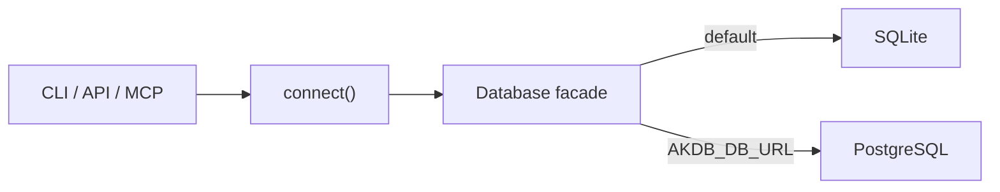

# Dual-backend architecture

## Purpose

AKDB supports two storage modes:

- SQLite is the zero-configuration default for local and embedded use.
- PostgreSQL is opt-in through `AKDB_DB_URL` for concurrent writers and server deployments.

Both backends are implementation details behind the same `Database` facade. CLI, API, MCP,
and services use that facade instead of importing a database driver directly.

## Runtime structure

## Backend boundary

Backend-specific behavior is confined to these five seams:

1. `architectural_knowledge_db/db/database.py` translates placeholders and normalizes the
   small connection surface used by AKDB.
2. `architectural_knowledge_db/db/connection.py` selects and configures the driver.
3. `architectural_knowledge_db/db/migrations.py` and `db/schema/pg/` select backend DDL.
4. `architectural_knowledge_db/services/search.py` implements native full-text search and
   the shared fallback.
5. `architectural_knowledge_db/services/import_export.py` guards the SQLite-only
   `PRAGMA database_list` backup path.

An `is_postgres` branch outside those seams is an architecture violation.

## Data and schema choices

- PostgreSQL migrations mirror all seven SQLite migrations.
- SQLite `BLOB` values use PostgreSQL `BYTEA`; embeddings remain portable packed float data.
- PostgreSQL full-text search uses a generated `tsvector` column and GIN index.
- PostgreSQL is an optional dependency; installing the default package does not install
  `psycopg`.
- Migrations run when the application starts, not once per API request.

## Quality gates

The complete test suite runs against SQLite unconditionally and against PostgreSQL when
`AKDB_TEST_DB_URL` is available. Compose verification covers both the default SQLite service
and the PostgreSQL override. See the accepted [decision record](../adr/ADR-AKDB-0001-dual-backend.md)
and the [PostgreSQL operations guide](../operations/postgres.md).

## Deferred work

Connection pooling, pgvector, a background-job service, and an ORM are deliberately outside
the first dual-backend release.
